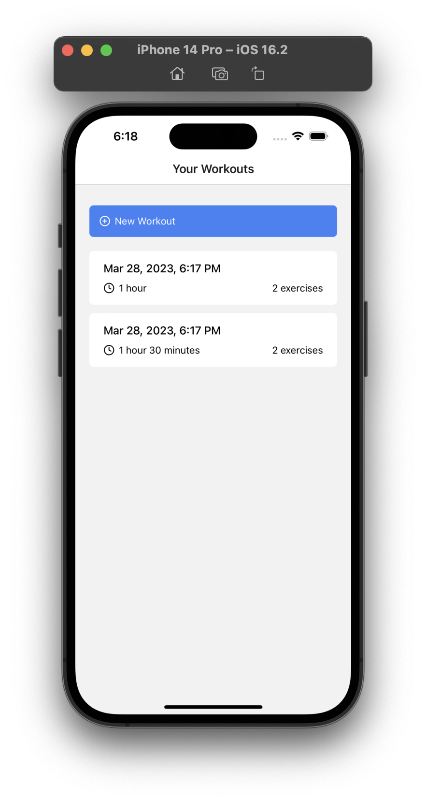
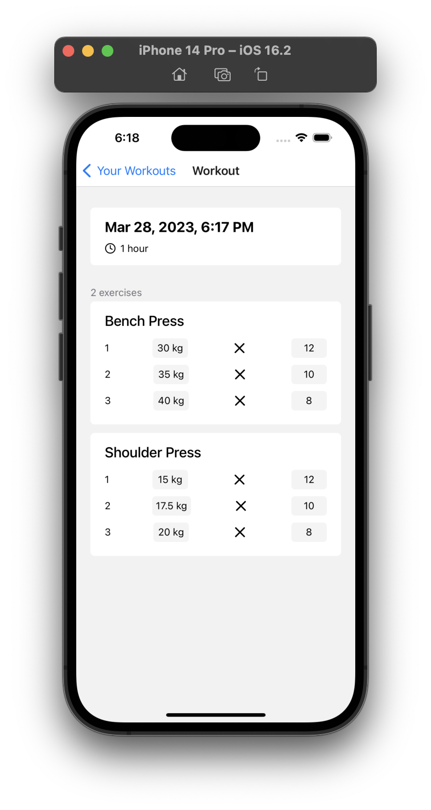

# WorkIt

An app to log your gym workouts

  
  

# TODO

- [ ] add persistence
- [ ] dark mode
- [ ] make it DRY
- [x] duration stopwatch
- [ ] visualize
- [ ] Redux Docs say ["We recommend putting as much logic as possible into reducers"](https://redux.js.org/faq/code-structure/#how-should-i-split-my-logic-between-reducers-and-action-creators-where-should-my-business-logic-go) - not following that right now. work on it
- [ ] delet set
